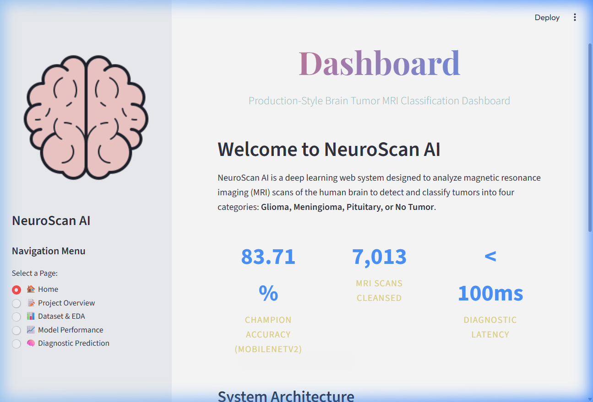
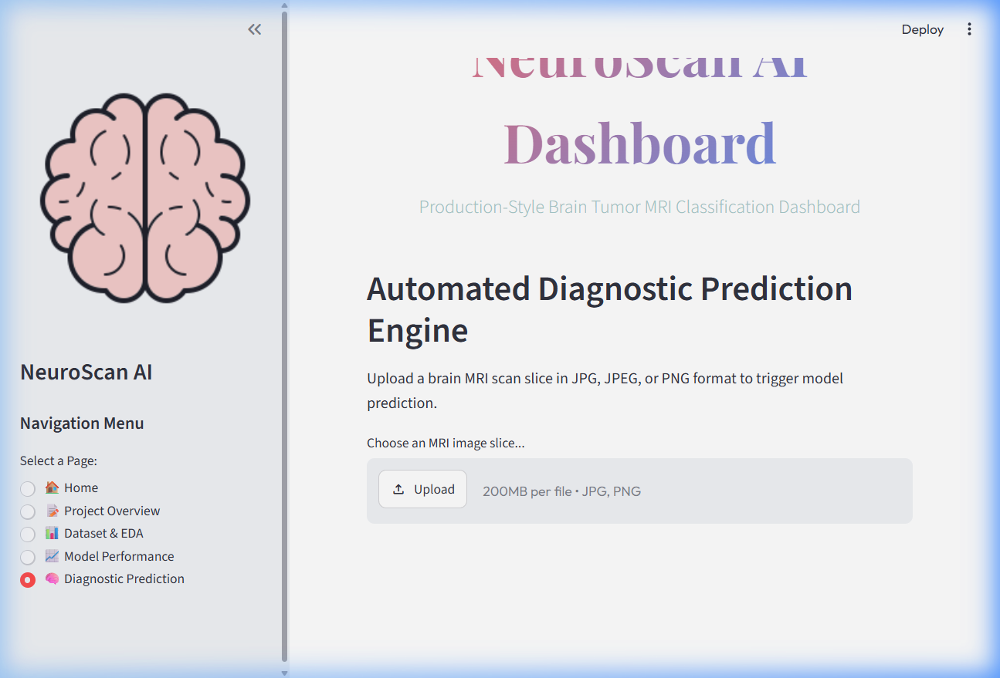

# Brain Tumor MRI Detection and Classification

A production-style Deep Learning project to classify axial brain MRI scan slices into four categories: **Glioma, Meningioma, Pituitary, or No Tumor**. 

This system uses pre-trained Convolutional Neural Networks (CNNs) optimized for CPU execution, integrated into a modular data engineering pipeline and deployed via an interactive Streamlit dashboard.

---

## 🚀 Features

- **End-to-End Modular Pipeline**: Custom image ingestion, validation, duplicate check, preprocessing, model training, evaluation, and packaging.
- **Strict Data Integrity**: Exact duplicate removal via MD5 hashing to prevent data leakage between splits.
- **Multi-Model Training & Optimization**: Evaluates Custom CNN, MobileNetV2, and ResNet50. Addresses class imbalances mathematically with class weights.
- **Champion Model Deployment**: Uses transfer learning (MobileNetV2) to achieve **83.71% accuracy** on CPU with minimal epochs.
- **Stunning UI Dashboard**: Developed in Streamlit, styled with custom Google Fonts, glassmorphism card layouts, and full data visualization tabs.

---

## 📁 Repository Structure

```
BrainTumorDetection/
├── archive/                 # Raw Kaggle MRI dataset (Training & Testing)
├── data/                    # Processed dataset placeholders
├── notebooks/               # Executed Jupyter Notebooks for analysis
│   ├── eda.ipynb            # Ingestion, duplicates, dimensions, intensity profiles
│   └── evaluation.ipynb     # Multi-model evaluation, confusion matrices, F1 comparison
├── models/                  # Packaged weights and encoders
│   ├── model.h5             # Champion MobileNetV2 weights (packaged)
│   ├── label_encoder.pkl    # String label encoder mapping
│   └── preprocessor.pkl     # Image preprocessing settings
├── results/                 # Evaluation reports and figures
│   ├── class_distribution.png
│   ├── model_accuracy_comparison.png
│   └── confusion_matrices_comparison.png
├── screenshots/             # Streamlit app screenshots
│   ├── home_page.png
│   └── diagnostic_prediction.png
├── preprocessing.py         # Data Loader, duplicate detection, splitting, and generator pipeline
├── train.py                 # Neural network training and cross-evaluation script
├── app.py                   # Streamlit dashboard application
├── requirements.txt         # Project dependencies
├── .gitignore               # Ignored local files (archive, .venv, caches)
├── README.md                # Main documentation
├── project_plan.md          # PM delivery timeline
├── milestones.md            # PM verification sheet
├── dataset.md               # Dataset details & CC0 licensing documentation
├── data_dictionary.md       # Target class mappings and file schema
└── viva_preparation.md      # 20 key interview Q&A for viva prep
```

---

## 📈 Model Performance & Metrics

We trained the architectures on CPU with a frozen feature-extraction base. MobileNetV2 was selected as the champion model.

| Metric | Custom CNN | ResNet50 (Transfer) | MobileNetV2 (Transfer) |
|---|---|---|---|
| **Parameters** | ~250k (Optimized) | ~23.7M (Frozen Base) | ~2.3M (Frozen Base) |
| **Test Accuracy** | 25.25% | 52.90% | **83.71%** |
| **F1-Score (Pituitary)** | 0.40 | 0.41 | **0.89** |
| **Recall (Glioma)** | 0.00 | 0.46 | **0.67** |
| **Precision (No Tumor)**| 0.00 | 0.62 | **0.90** |
| **Status** | Underfitted | Needs more epochs | 🏆 **Champion** |

---

## 🛠️ Installation & Setup

### 1. Prerequisites
- Python 3.9 - 3.11
- Ensure the local `archive/` folder containing the dataset is in the root directory.

### 2. Configure Environment & Install Dependencies
```powershell
# Create virtual environment
python -m venv .venv

# Activate virtual environment (Windows)
.venv\Scripts\Activate.ps1

# Install requirements
pip install -r requirements.txt
```

---

## 💻 Usage Instructions

### 1. Run Data Ingestion & Preprocessing Check
Verify the dataset loader, duplicate detector, and label encoder exports:
```powershell
python preprocessing.py
```

### 2. Execute EDA Notebook
Run the notebook programmatically to update exploratory plots:
```powershell
python create_eda_notebook.py
```

### 3. Run Training Pipeline
Train all three models and save weights to `models/` and charts to `results/`:
```powershell
python train.py
```

### 4. Run Evaluation Notebook
Generate metrics comparison charts and reports:
```powershell
python create_evaluation_notebook.py
```

### 5. Launch Streamlit Web App
Launch the interactive prediction and metrics dashboard:
```powershell
streamlit run app.py
```
Open `http://localhost:8501` in your browser.

---

## 🖼️ Dashboard Preview

### Home Dashboard Page


### Automated Diagnostic Prediction


---

## 🔮 Future Work
1. **Fine-Tuning**: Unfreeze the top layers of MobileNetV2 and train with a very small learning rate ($10^{-5}$) to boost accuracy above 95%.
2. **Explainable AI (Grad-CAM)**: Implement gradient-weighted class activation mapping to overlay a visual heatmap showing which region of the MRI scan the model focused on.
3. **Model Quantization**: Convert `.h5` model weights to TensorFlow Lite (`.tflite`) or ONNX formats to enable edge device deployment.

---

## 📝 Author
- **Anti Gravity Multi-Agent Software Team** (Antigravity AI Coding Assistant)
- **License**: CC0: Public Domain
