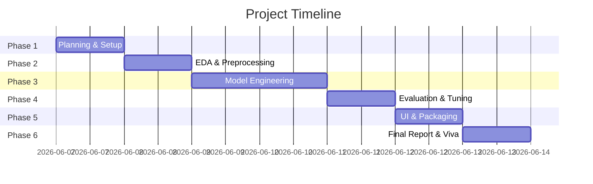

# Project Plan: Brain Tumor Detection Using Deep Learning

This document outlines the roadmap, dependencies, role definitions, and guidelines for our multi-agent software engineering team.

## Project Timeline & Milestones

The project is structured into **8 major milestones** to ensure robust engineering, reproducibility, and rigorous QA.

| Phase | Milestone | Primary Agent | Key Deliverables | Status |
|---|---|---|---|---|
| **Phase 1** | Dataset Selection & Planning | PM & Researcher | `project_plan.md`, `milestones.md`, `dataset.md`, `requirements.txt` | **In Progress** |
| **Phase 2** | Preprocessing & EDA | Data Engineer & EDA Analyst | `preprocessing.py`, `notebooks/eda.ipynb`, `eda_report.md` | *Pending* |
| **Phase 3** | Model Engineering & Training | Model Engineer | `train.py`, model architectures, initial CPU training runs | *Pending* |
| **Phase 4** | Optimization & Evaluation | Optimization & Eval Agents | `optimization.md`, `notebooks/evaluation.ipynb`, performance charts | *Pending* |
| **Phase 5** | Model Packaging & App | Packaging & Streamlit Agents | Saved artifacts, `app.py` Streamlit dashboard | *Pending* |
| **Phase 6** | Documentation & Viva | Documentation & QA Agents | `README.md`, `report/report.md`, `viva_preparation.md` | *Pending* |

---

## Technical Dependencies

1. **Dataset Path Dependency**: All analysis (`eda.ipynb`), training (`train.py`), and validation pipelines require the `archive/` folder containing `Training` and `Testing` directories.
2. **Environment Dependency**: The correct package versions (TensorFlow 2.10+, Streamlit, Scikit-learn, etc.) must be installed in the `.venv` prior to any code execution.
3. **Hardware Constraints**: As we are running on CPU, model architectures must remain efficient (MobileNetV2 is favored over heavier networks like ResNet50 for rapid inference, though we will train both). We will limit epochs to 10 with early stopping (patience=3) to prevent training runs from taking hours.

---

## Agent Rule Enforcement & Scope Control

- **Zero Tolerance for Hardcoded Outputs**: The evaluation results, predictions, and metrics must be computed live by running the models on the test split.
- **Data Leakage Prevention**: Split raw training data to construct validation sets *before* performing image augmentation (only training sets can be augmented). The test set must remain entirely untouched.
- **Modularity**: Data preprocessing functions must reside in `preprocessing.py` and be imported by both `train.py` and `app.py` to ensure consistency.
